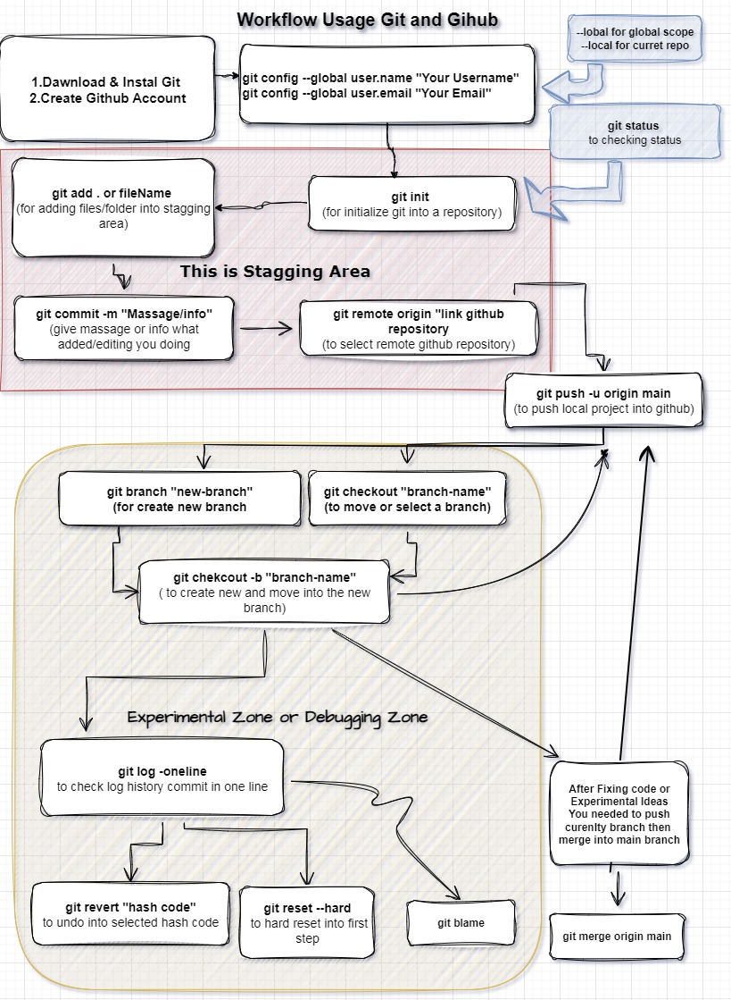

# Learning Git and GitHub Synchronization

## Overview
This guide explains how to set up Git and sync with GitHub using Personal Access Token (PAT). This documentation is created for learning purposes and testing GitHub synchronization.

## Github Workflow



## Prerequisites
- Git installed on your local machine
- GitHub account
- Basic understanding of command line interface

## Setup Steps

### 1. Install Git
First, download and install Git from the [official website](https://git-scm.com/).

### 2. Configure Git
Set up your Git configuration using the following commands:

```bash
# Global configuration (for all projects)
git config --global user.name "Your GitHub Username"
git config --global user.email "Your GitHub Email"

# OR for local project configuration
git config --local user.name "Your GitHub Username"
git config --local user.email "Your GitHub Email"
```

### 3. Generate Personal Access Token (PAT)
1. Go to GitHub Settings
2. Navigate to Developer Settings
3. Select Personal Access Tokens
4. Generate new token with required permissions

### 4. Project Setup and Push
Follow these steps to initialize and push your project:

```bash
# Initialize Git repository
git init

# Add files to staging
git add .

# Commit changes
git commit -m "Your commit message"

# Create new repository on GitHub

# Link and push to GitHub
git push --set-upstream origin <branch-name>
```

When prompted:
- Username: Your GitHub username
- Password: Use your PAT (Personal Access Token)
Alternative: Use GitHub Account via Windows Credential Manager
## Alternative Authentication: Use GitHub Account via Windows Credential Manager

### Alternative Set Up GitHub Authentication Using Windows Credential Manager:

  1. Open **Control Panel** and go to **Credential Manager**.
   
  2. Under **Windows Credentials**, click on **Add a Windows credential**.

  3. In the pop-up window, enter the following details:
     - **Internet or network address**: `git:https://github.com`
     - **Username**: Your **GitHub username**
     - **Password**: Your **Personal Access Token (PAT)** (copy and paste the token you generated on GitHub).
   4. Click **OK** to save the credentials.
for mor detail For more detail [Github Credential](https://github.com/git-ecosystem/git-credential-manager/blob/main/docs/github-apideprecation.md)

### 5. Next Steps
Feel free to explore other Git commands and features:
- Creating branches
- Switching between branches (checkout)
- Merging branches
- Pull requests

## Additional Information
- This guide is maintained for personal learning purposes
- Feel free to explore and experiment with Git commands

## Contact & Credits
- Discord: @code_no78
- Special thanks to:
  - Mr. Hadat (GitHub: Hadat MTCHX)
  - ChatGPT
  - Stack Overflow community/etc

## Note
I'm currently learning programming and started with Git to better manage future projects. Any suggestions or improvements are welcome!
